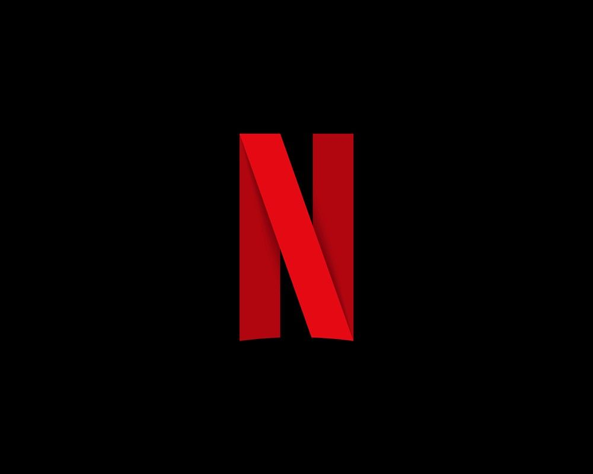

<!-- PROJECT LOGO -->
 

  
  

    Netflix clone
     
    <a href="https://netflix-clone-fc895.web.app/">View Demo</a>
  

<!-- TABLE OF CONTENTS -->

  
Table of Contents

  <ol>
    <li>
      <a href="#about-the-project">About The Project</a>
      <ul>
        <li><a href="#built-with">Built With</a></li>
      </ul>
    </li>
    <li><a href="#contact">Contact</a></li>
  </ol>

<!-- ABOUT THE PROJECT -->

## About The Project

[![Screenshot1][product-screenshot1]](https://example.com)
[![Screenshot2][product-screenshot2]](https://example.com)

[Netflix 홈페이지](https://www.netflix.com/kr/)를 클론 코딩한 프로젝트입니다. TMDB API를 통해서 영화 데이터를 가져왔고, React와 CSS를 이용하여 화면을 구성했습니다. Swiper 라이브러리를 통해서 슬라이드를 만들었습니다. 로그인/로그아웃은 Firebase의 Authentication 서비스를 이용하였습니다. 그 외 유저에 대한 상태 정보 저장은 Redux를 사용했습니다.

### Built With

- [React](https://reactjs.org/)
- [Redux](https://redux.js.org/)
- [Firebase](https://firebase.google.com/)
- [TMDB API](https://developers.themoviedb.org/3)
- [Swiper](https://swiperjs.com/react)

## Contact

Lee Jongseo - goldemshine@gmail.com

[product-screenshot1]: ./screen1.PNG
[product-screenshot2]: ./screen2.PNG
